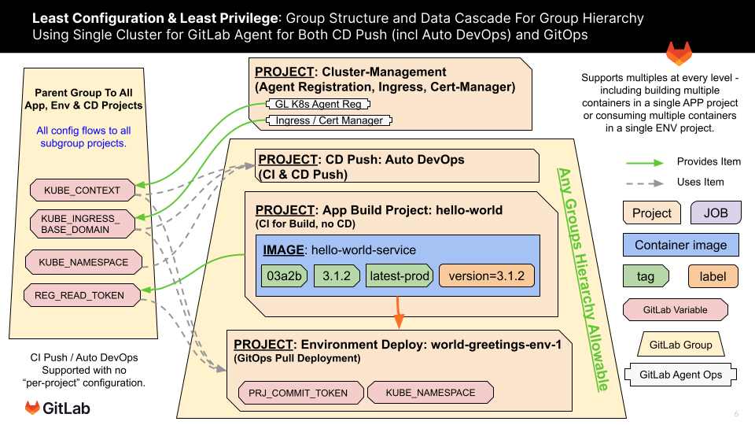
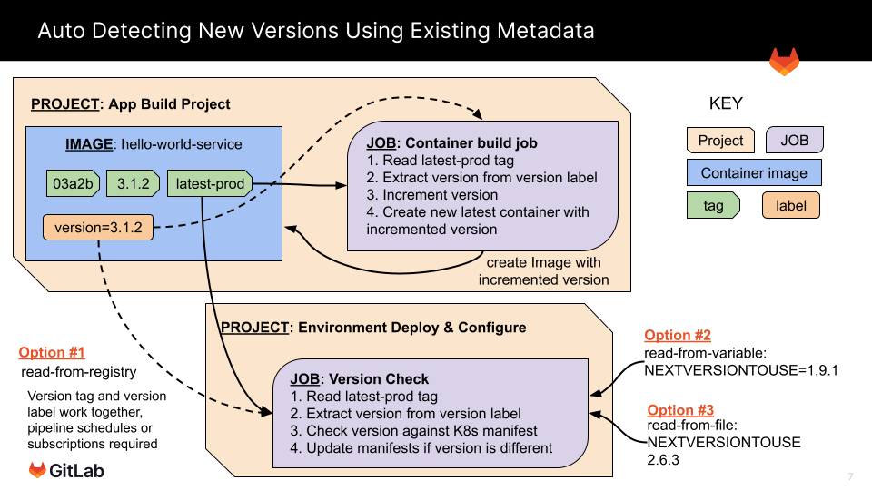



## Learning Outcomes and Time Estimates

These timing estimates are just for completing exercises and do not include breaks nor handling individual assistance.
Learning outcomes are always a trade-off with time, so this table is provided to help map what learning objectives are desireable and therefore how much time will be needed.

| Activity and Outcomes                                        | Keyboard Time | Automation Wait Time  | Total Time   | Do As Prep?  (Only When Instructor Led) |
| ------------------------------------------------------------ | ------------- | --------------------- | ------------ | -------------------------------------------- |
| **Section 2: Shared Resources Deployment Activities**  Prep steps can be deployed once per group if EKS deployment and integration is not the main focus. For individuals or those practicing cluster setup and integration, these can be done by each participant as well **Dependencies:** All labs depend on section 2 because it sets up the cluster and GitLab integration. **Outcomes**: Deploy EKS with official AWS IaC [in a cost-efficient format for training](#simple--inexpensive-eks-pattern-reusable-for-training) (performed by instructor for instructor-led) | **65 mins**   | **80 mins**           | **145 mins** |                                              |
| Prep: GitLab Group and AWS Account                           | 20 mins       | 20 mins               |              | Yes                                          |
| Prep Lab 2.1: Provision a Kubernetes Cluster Using The AWS EKS Quick Start | 5 mins        | 60 mins               |              | Yes                                          |
| Prep Lab 2.2: Prepare GitLab classgroup and Deploy a Runner (In Parallel with 2.1 Wait Time) | 20 mins       | 20 mins (In Parallel) |              | Yes                                          |
| Prep Lab 2.3: Deploy a Runner and Use GitLab K8s Agent to Integrate The Cluster with GitLab **Outcomes**: GitLab EKS Cluster Integration Using GitLab Agent Connection Method (performed by instructor for instructor-led) | 20 mins       | 2 mins                |              | Yes as a Demo                                |
| **Section 3: GitLab CD and Auto DevOps via The GitLab Kubernetes Agent** (Optional) **Dependencies:** Section can be skipped if not relevant to participant use cases (no subseqent labs depend on this one) **Outcome:** Participants understand that traditional CI/CD Push operations (including Auto DevOps) are still supported with the GitLab Kubernetes Agent Cluster integration method. | **20 mins**   | **15 mins**           | **35 mins**  |                                              |
| Lab 3.1: Create a Personal Group                             | 5 mins        | N/A                   |              |                                              |
| Lab 3.2: GitLab Auto DevOps via the K8s Agents  **Outcome:** Participants see that a GitLab Runner can talk to the Kubernetes Agent through the connection it reached out and made to the GitLab instance. This is called tunneling because it reuses the connection the agent established to the cluster to push instructions. | 15 mins       | 15 mins               |              |                                              |
| **Section 4. GitLab GitOps via The GitLab Kubernetes Agent**  **Dependencies:** Does not depend on Section 3, but Section 5 does depend on this section. | **80 mins**   | **20 mins**           | **100 mins** |                                              |
| Lab 4.1: Create a Personal Group                             | 1 mins        | N/A                   |              |                                              |
| Lab 4.2: Prepare the Application Project  **Outcome:** Participants create an Application Creation project that demonstrates a GitOps best practice of cleanly seperating Container Build from Environment Deployment. This also cleanly seperates the need for GitLab runners for Build, while the GitLab Agent alone can perform deployment. | 20 mins       | 2 mins                |              |                                              |
| Lab 4.3: Prepare the Environment Deployment Project  **Outcome:** Participants create an Environment Deployment project that demonstrates a GitOps best practice of cleanly seperating Container Build from Environment Deployment. The GitOps agent is completely responsible for pulling the application onto the clusters. | 25 mins       | 5 mins                |              |                                              |
| Lab 4.4: Link and Test Projects  **Outcome:** Observe how changes in the Application Project are consumed by the Environment Deployment project. At this point, the only changes are in application manifests. | 5 mins        | 3 mins                |              |                                              |
| Lab 4.5: Setup the GitOps Pull Agent  **Outcome:** Participants enable the GitOps mode of the GitLab Agent and see their appilcation manifests deploy. | 10 mins       | 5 mins                |              |                                              |
| Lab 4.6: Update the Application Project  **Outcome:** Participants update the Application Code and watch the automation cascade between both projects and into both environments. | 20 mins       | 5 mins                |              |                                              |
| **GitLab Review Environments and Security Scanning for GitOps (optional)** Can stop at any lab if subsequent labs are not of interest. **Dependencies:** Builds on top of Section 4. **Outcome**: GitLab DevSecOps and Dynamic Review Environments are added to a true GitOps project to ensure GitOps Pull Deployment style setups benefit from proper code review and security scanning. | **70 Mins**   | **50 Mins**           | **120 Mins** |                                              |
| Lab 5.1: Add Environments and Security Scanning to the Application Project (Optional) **Outcome:** Learn to setup GitLab Environments and Security Scanning work with GitOps workflows. | 20 Mins       | 10 Mins               |              |                                              |
| Lab 5.2: Merge Request and Review Environment (Optional) **Outcome:** Learn to setup GitLab Dynamic Per-Feature Branch Environments and MR Security Results work with GitOps workflows. | 10 Mins       | 5 Mins                |              |                                              |
| Lab 5.3: Merge MR and Deploy to Environment (Optional) **Outcome:** Observe full workflow of changes with Dynamic Environments and MRs to push all the way to production environment with GitOps workflows. | 10 Mins       | 10 Mins               |              |                                              |
| Lab 5.3 Part B: GitOps CD Pull Changes to Production (Optional) **Outcome:** Observe full workflow of changes with Dynamic Environments and MRs to push all the way to production environment with GitOps workflows. | 10 Mins       | 5 Mins                |              |                                              |
| Lab 5.4: Add Kubernetes Manifest Security Scanning (Optional) **Outcome:** Learn to setup GItLab Security Scanning of Kubernetes Manifests with GitOps workflows. | 15 Mins       | 10 Mins               |              |                                              |
| Lab 5.5: Add Cluster Image Security Scanning (Optional) **Outcome:** Learn to setup GItLab Security Scanning of Kubernetes Clister Images (that are used in your cluster, but not developed in your CI)  with GitOps workflows. | 5 Mins        | 10 Miins              |              |                                              |

## Reusable Patterns For Production and Training

### Reusable Patterns for Production

The following patterns are reusable in production environments.

#### For CD Push and GitOps: Group Level Integration With Automatic Per-Project Abstractions

For both major scenarios covered by the Kubernetes Agent, this workshop models doing the integrations at a group level and then ensuring that Kubernetes namespace uniqueness is handled for environments - including Auto DevOps environments. This is similar to how both Auto DevOps and Kubernetes Certificate Connections have traditionally operated, but it requires that specific patterns are followed to achieve it.

#### CD Push Scenarios: Auto DevOps, Dynamic Review Environments and Security Scanning 

Demonstrates preservation of GitLab Auto DevOps, Auto Dynamic Review Environments and Security Scanning while using GitLab Agent connection method. Does so for **an entire group heirarchy** similar to the former Certificate Connection Method. Done through strategic group placement of Auto DevOps CI/CD Variables and GitLab Agent registration shown here:

#### GitOps: Auto DevOps, Dynamic Review Environments and Security Scanning

GitLab GitOps pattern retains usage of Auto DevOps, Dynamic Review Environments and Security Scanning to **qualify new application versions for GitOps scenarios.** This is done through Auto DevOps enablement in the Application Building Project.

#### GitOps: Loose Project Coupling

Loose coupling between the Application Building Project and the Environment Deployment Project **[accomodates many production oriented GitOps deployment scenarios](https://gitlab.com/guided-explorations/gl-k8s-agent/gitops/envs/world-greetings-env-1#loose-project-coupling).**

#### GitOps: Promote Image to Latest Only If Testing Passes

An Application Build Project image is only tagged as “latest” if the pipeline passes. If staging is enabled, it is also a manual step.

#### GitOps: Least Configuration

**Least Configuration** - template repositories for exercises are designed to be self-abstracting so that there is as little manual code updates to the scaffolding as possible before it is ready to run. For instance, the Application Build Project is simply copied to a new sub-group or new name and it is ready to build. The Environment Deployment project requires a manual update to map it to the correct Application Project and it is ready to run. This capability is a result of the above models of Group Level Integration combined with leveraging existing artifact metadata to detect the latest version of an image for incrementing in the Application Build Project and for version update detection in the Environment Deploment Project as depicted here:

#### GitOps: Least Privilege

**Least Privilege** - the two GitOps projects define the least possible shared privileges at the lowest possible group level. For instance the Application Build Project only defines a read registry permissions for a deployment token and only stores it high enough in the group heirarchy that any consuming Environment Deployment Projects can utilize it. The Environment Deployment Projects define a git read and write token back to themselves and only publish it at their own project level where it is used.

## Reusable Patterns for Training

These exercises configure the GitLab Kubernetes Agent to function similarly to the depreciated certificate connection method in that configuring at a group level enabled the entire subgroup heirarchy of that group to be able to access the cluster and not have name uniqueness conflicts. This is highly desirable in a classroom context and may be desirable for production if the previous group level GitLab certificate cluster connections were leveraged by your organization.

To accomplish this:

1. A single Kubernetes Cluster is deployed and…
2. Integrated using a single GitLab Kubernetes Agent…
3. That has a management scope of a top level group and all its subgroups and…
4. That services both **CI/CD Push** AND **GitOps** scenarios…
5. Which have **working Review Environments** for participants to observe results of changes…
6. The small amount of code editing is specified as being done in the Web IDE - avoiding all challenges with getting repository cloning working to each participant workstation (but you can still have them do workstation cloning if desired)

This keeps classroom logistics simple.

It is also what leads to the limitation of having all projects be public - if a Kubernetes agent registration is done in the same project as the manifest files, then the project does not have to be public.



In a real world scenario there can be many GitLab Agents in many GitLab groups and projects integrating to the same Kubernetes cluster and/or agents integrating to many independent clusters. The agents can be registered at any group level and could be dedicated to just CI/CD Push or just GitOps.



## Simple & Inexpensive EKS Pattern Reusable for Training


A key difference between the legacy GitLab Kubernetes Certificate cluster connection and the GitLab Kubernetes agent configuration is that you cannot multi-attach a single cluster agent to multiple locations in the group heirachy.


### Rapid Deployment & Simplicity

- **AWS EKS Quick Start** - IaC that results in autoscaling EKS cluster running on spot instances
- **Simple Zero Footprint IaC Workstation** - EKS Quick Start Built-in Bastion Host.
  - The bastion host automatically comes with aws cli, kubectl, helm.
  - The bastion host machine has IAM permissions to the cluster.
  - Multiple folks can login or the bastion host ASG can be resized to provide a bastion for each participant.
- **Simple and Fast SSL and DNS** - leveraging Kubernetes Ingress, Cert Manager and nip.io DNS support.

### Security Best Practices

- **Private K8s Control API Endpoint via GitLab K8s Agent** - GitLab integration without exposing K8s Control API Endpoint.
- **SSM Session Manager to Bastion Host for CLI Admin** - SSM allows IAM access control (instead of keys) and full audit logging of all commands run on the cluster to CloudWatch. No ports or network routes need to be setup to access the bastion host. SSM Session Manager web console allows zero workstation configuration.

### Cost Control

- uses a 2 AZ, 2 spot Node Cluster with small t2 instances in us-east-2 region - keeping these settings makes the process as simple as possible
- With the EKS Cluster Autoscaler Installed to allow use of small instances that scale when used by more people or projects
- With Spot Instances Nodes for Cost Control
- With "Scale to Zero Instances" support (EKS Control plane is a service so does not need nodes to run)
- With cluster node availability scheduling for cost control when the cluster is not in use
