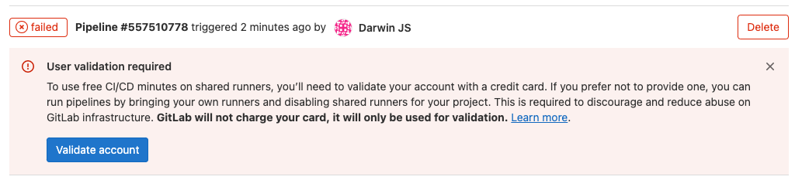

# Tuning and Troubleshooting



## General

### Using the EKS Bastion for cluster administration with kubectl and helm

1. [Click here to open the EC2 Instances Console in us-east-2](https://us-east-2.console.aws.amazon.com/ec2/v2/home?region=us-east-2#Instances:instanceState=running)

2. In the EC2 Instances console, *locate* the instance named **EKSBastion**

3. *Right click* **the instance**, *select* => **Connect**  => **Session Manager** => **Connect** (button)

   
   kubectl and helm are now available on your path and the bastion instance already has administrative permissions to the cluster. Remember the above sequence for gaining access to CLI based cluster admin.
   

### GitLab Agent and GitOps Pull Deployments

To view the GitLab Agent log in the cluster you can use this command: `kubectl logs -f -l=app=gitlab-agent -n gitlab-agent`

Add the following to the agent configuration file for more verbose logging:

```yaml
observability:
  logging:
    level: debug
```

For common errors and more troubleshooting information visit [Troubleshooting the GitLab agent for Kubernetes](https://docs.gitlab.com/ee/user/clusters/agent/troubleshooting.html)

### Cluster or Agent Gets In an Uncertain State

When the EKS QuickStart was used to build the cluster, you can locate the ASG for the cluster nodes and scale to zero and back to the number that was in place. This takes some time (probably 15 minutes for a 2 node cluster) so it may need to be an absolutely last resort in an active classroom environment.

## Errors

### User validation required



Resolution: You have missed the last steps of Prep Lab 2.2 for disabling group runners (and you or participants are using a free account).

## Classroom

### Scaling Down ASGs

If you decide to scale down any Auto Scaling Group associated with the classroom, always do so by editing the ASG object in the AWS console so that appropropriate job draining, deregistration and other activities are done by the ASG termination hooks.

### Scheduled Scaling for Long Lived Setups

If this classroom setup is long lived for any reason, the ASGs can used scheduled scaling to scale to zero during unused times (e.g. nights and weekends). The sample apps in this workshop are stateless which allows the EKS cluster to scale to zero nodes at unused times. If you install a Kubernetes runner, it’s registration status does not survive termination.

### GitLab CI Is Too Slow for Classroom



While it may be tempting to use shared runners, deploying your own fleet gives you 100% control over the scale and responsiveness of runners. Since automation waiting time is a big part of this workshop it is a signficant advantage to have control over this part of the resourcing.




The provisioning Prep Lab contains this warning: “**IMPORTANT FOR Instructor-Led** - setup 1 runner instance per 5 students. This can be easily adjusted later and these are spot instances.”


If the course is being run on GitLab.com with free GitLab.com accounts for participants and/or the instructor and an Ultimate Trial enabled (only works for 30 days from initial trial enablement), the using  [GitLab HA Scaling Runner Vending Machine for AWS EC2 ASG](https://gitlab.com/guided-explorations/aws/gitlab-runner-autoscaling-aws-asg/) to deploy runnres is required.

While it is optional if you are working on licensed accounts on GitLab.com or a self-managed instance, using it also allows you fuller control over the runner fleet performance and therefore CI wait times.

To fix slow runners you can deploy  [GitLab HA Scaling Runner Vending Machine for AWS EC2 ASG](https://gitlab.com/guided-explorations/aws/gitlab-runner-autoscaling-aws-asg/). Or if you have already used the vending machine you can scale up runners to increase CI speed. They will come online, register in GitLab in the same group as the original deployment with no interruption or special actions taken by participants. 

If you were relying on shared runners, you will need to disable them at the group to force usage of your runner fleet.

If this is a post deployment step, simply update the ASG that is controlling the runners to have more runner instances (increase Maximum and Desired counts). They will come online, register in GitLab in the same group as the original deployment with no interruption or special actions taken by participants.

To scale the cluster, [open the ASG console](https://us-east-2.console.aws.amazon.com/ec2autoscaling/home?region=us-east-2#/details) (this link presumes us-east-2, but you can change the region if you deployed elsewhere). Locate the ASG associated with your EKS cluster which also has “UnmanagedASG” in it’s name. Locate the ASG associated with your runners - if you used the exercise defaults to deploy it, is shoudl be called “linux-docker-spotonly”. To change the size, follow [Set capacity limits on your Auto Scaling group](https://docs.aws.amazon.com/autoscaling/ec2/userguide/asg-capacity-limits.html). 


Should you choose to scale the runner fleet down, do so by editing the ASG Desire Count so that proper GitLab Runner deregistration processes are triggered.


### EKS Cluster Seems Slow and/or is Not Autoscaling Appropriately for Classroom


The provisioning Prep Lab contains this warning: “**IMPORTANT FOR Instructor-Led** - setup 1 EKS node per 5 students. This can be easily adjusted later and these are spot instances.”


While the Cluster Autoscaler should be active you can also take manual control of the minimum size by manipulating the Minimum size of the cluster. 

The most likely scenario is that your Maximum size has been reached and you need to bump it. 

To scale the cluster, [open the ASG console](https://us-east-2.console.aws.amazon.com/ec2autoscaling/home?region=us-east-2#/details) (this link presumes us-east-2, but you can change the region if you deployed elsewhere). Locate the ASG associated with your EKS cluster which also has “NodeGroupStack” in it’s name. Locate the ASG associated with your EKS cluster which also has “UnmanagedASG” in it’s name. To change the size, follow [Set capacity limits on your Auto Scaling group](https://docs.aws.amazon.com/autoscaling/ec2/userguide/asg-capacity-limits.html). Keep in mind that Maximum count limits the cluster autoscaler - which you might want to do for stability or you may want to enable it for efficiency. 

### I would like More Bastion Hosts for the Classroom

If students will be doing cluster control activities on a shared cluster, you many want more bastion host instances. However, keep in mind that the existing one supports multiple simultaneous SSM logins and they are not spot instances. Since they are in an ASG this is an easy to change the number of Bastion hosts.

To scale the bastion host ASG, [open the ASG console](https://us-east-2.console.aws.amazon.com/ec2autoscaling/home?region=us-east-2#/details) (this link presumes us-east-2, but you can change the region if you deployed elsewhere). Locate the ASG associated with your EKS cluster which also has “BastionStack” in it’s name. To change the size, follow [Set capacity limits on your Auto Scaling group](https://docs.aws.amazon.com/autoscaling/ec2/userguide/asg-capacity-limits.html). 

Once scaling is complete you may wish to use the EC2 console to rename them for unique names.
