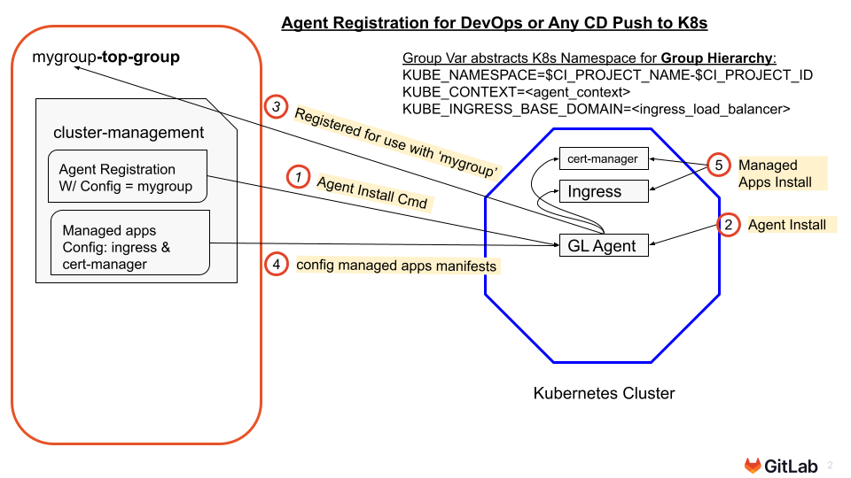

{}

**Instructor-Led Note**: [The visuals in this section are also provided as progressive disclosure Visual MicroStory Slides here](../010_introduction/Animated_Visual_MicroStory_Slides_for_GitLab_Kubernetes_Agent_Workshop.pptx)
{}

### Section 2: Shared Resources Deployment Activities

Prep steps can be deployed once per group if EKS deployment and integration is not the main focus. For individuals or those practicing cluster setup and integration, these can be done by each participant as well **Dependencies:** All labs depend on section 2 because it sets up the cluster and GitLab integration. **Outcomes**: Deploy EKS with official AWS IaC [in a cost-efficient format for training](#simple--inexpensive-eks-pattern-reusable-for-training) (performed by instructor for instructor-led)

### Visual Overview of GitLab Agent Group Level Cluster Integration

{}

**Key Aspects:**

1. While the cluster integration project lives within the group, the configuration file can point to it’s parent group.
2. Specific GitLab variables are set at the group level and inherit by all downbound groups.
3. KUBE_CONTEXT and KUBE_INGRESS_BASE_DOMAIN are shared with all projects to ensure they work appropriately in the cluster.
4. The KUBE_NAMESPACE variable uses project variables that are unique to ensure all projects go into the cluster uniquely
   1. KUBE_NAMESPACE is overridden in GitOps projects to include the environment.
5. REG_READ_TOKEN - Only Read Access, Only to the Container Registry is given. In labs this is a Deployment Token. In production it should use a Group Access Token to give read permissions to all App Build Project container registries to all related Environment Deployment Projects.

{}

### Visual Overview of Agent Registration Process

{}{}