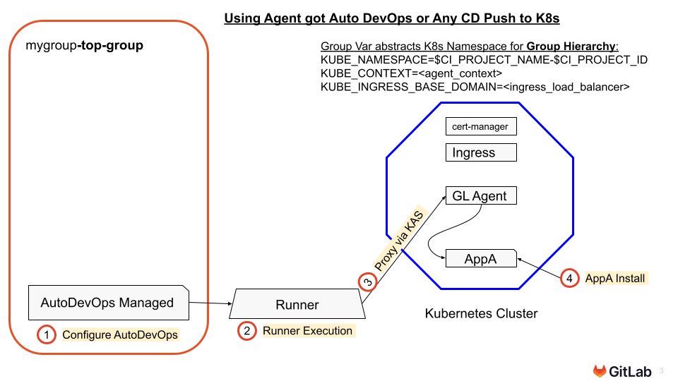



**Instructor-Led Note**: [The visuals in this section are also provided as progressive disclosure Visual MicroStory Slides here](../010_introduction/Animated_Visual_MicroStory_Slides_for_GitLab_Kubernetes_Agent_Workshop.pptx)



This configuration also works for any kind of **GitLab Runner Push CD** to the cluster using Helm and kubectl commands, not only Auto DevOps.


### Section 3: GitLab CD and Auto DevOps via The Gitlab Agent for Kubernetes 

**Dependencies:** Section can be skipped if not relevant to participant use cases (no subsequent labs depend on this one) **Outcome:** Participants understand that traditional CI/CD Push operations (including Auto DevOps) are still supported with the Gitlab Agent for Kubernetes Cluster integration method.

### Visual Overview of The Deployment Process

{}{}

### Visual Overview of the Auto DevOps Pipeline

{}{}
