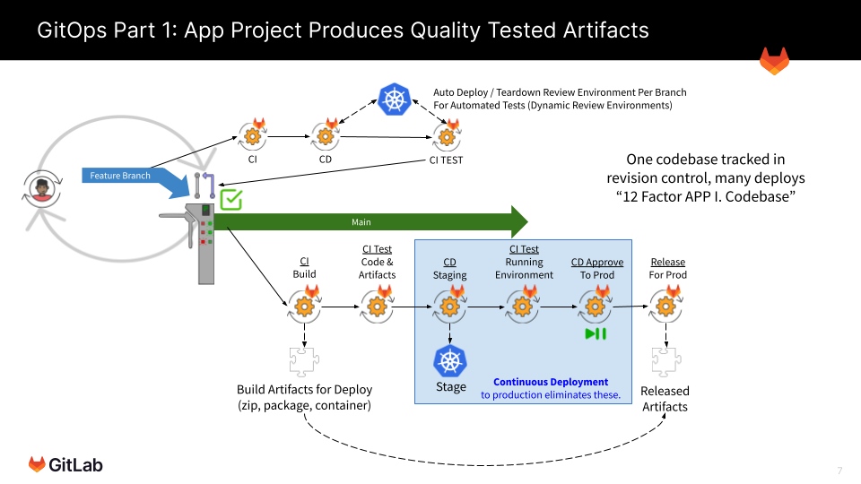

# Lab 4.2: Prepare the Application Project

> **Keyboard Time**: 20 mins, **Automation Wait Time**: 2 mins
>
> **Scenarios:** Instructor-Led, Self-Paced



A common GitOps convention is to seperate Application Build repositories from Environment Deployment repositories. This lab sets up the Environment Deployment repository to follow this convention.





1. Create a GitOps Application Build project from a template.

2. Create and publish (in a group CI/CD variable) a token that allows the Environment Deployment project to read the container images in the Application Build project.

   

{}

{}



Before continuning make sure to use DNSChecker.com to check if both `the Load Balancer DNS Name` and `Load Balancer IP`**.nip.io** have propagated through global DNS and wait (or troubleshoot) if they have not.




This project auto-increments images with a simple semantic version (prereleases not supported). You can also force a specific version number and tell it which part of the version number to auto-increment.


1. While in 'yourpersonalgroup' (created in a prior lab) *Click* **New project** (button) and then *Click* **Import project**

2. On the 'Import project' page, *Click* **Repository by URL**

3. On the next page, for 'Git repository URL' *Paste* **https://gitlab.com/guided-explorations/gl-k8s-agent/gitops/apps/hello-world.git**

4. In 'Project name' *Type* **Hello World** (may already be defaulted to this)

5. *Scroll down* to ‘Visibility Level’

6. *Click* **Public**.

    
Projects that are used by the GitLab Agent must be public when the agent registration is done in a project other than the one the deployment happens from and when the image being sourced is not using a stored docker login secret.
    

7. Near the bottom of the page *Click* **Create project** (button)

8. On the left navigation bar, *Click* **CI/CD => Pipelines**

9. In the upper right of the page, *Click* **Run pipeline** (button)

10. On the ‘Run pipeline page’, leave the defaults and in the lower left of the page *Click* **Run pipeline** (button)

     > The code is designed to increment an image version from the container registry of your project. If no image is found, it starts at version 0.0.1.

11. **[Automation wait: ~1 min]** Wait for the pipeline to complete successfully.

12. On the left navigation panel, *Click* **Packages & Registries => Container Registry**

13. On the Container Registry page click the item ending in “/main”

     > You should see a version tag, a git short sha tag and a latest-prod tag that all have the same value for “Digest”

14. On the left navigation bar, *Click* **CI/CD => Pipelines**

15. In the upper right of the page, *Click* **Run pipeline** (button)

16. On the ‘Run pipeline page’, Change the value of the variable “NEXTVERSION” to **1.0.0** (replace the text ‘increment-existing-image-version’)

17. *Click* **Run pipeline** (button)

18. **[Automation wait: ~1 min]** Wait for the pipeline to complete successfully.

19. On the left navigation bar, *Click* **Packages & Registries => Container Registry**

20. On the Container Registry page **click the [line item ending in “/main”]**

     > Among the tags you should see a 0.0.1 version tag and a 1.0.0 version tag.
     >
     > Note: the next time the pipeline runs it will increment 1.0.0 to 1.0.1 automatically because it will read the current version from the latest image.



This source project followed several specific principles that makes it this easy to use as a template:

1. Soft codes most of the paths to be self referential to the project path name.
2. When looking in the project container registry for the last image version, it handles an error in reading the container image as an indicator this is the first run and then forces the version number to 0.0.0 before it is incremented and a new container is generated. Subsequent builds then find the latest-prod image.
3. Avoids use of the ‘latest’ tag as it is very common and might be created by other unknown build processes that are integrated later.



### Create a Token To Read The Container Registry


For the next steps you will create a Project Deployment Token so that the Environment Deployment project can read the container image of this Application Build project. If you have a paid GitLab license, a project or group level ‘Access Token’ can give the same access to all container registries in a group heirarchy. This works well if there is high trust between all Application Build and Environment Deployment projects as there are fewer credentials granted at an appropriate level.


1. While in 'yourpersonalgroup/hello-world' in the left navigation, *Click* **Settings => Repository** (button) 

2. Next to ‘Deploy tokens’ *Click* **Expand**

3. Under ‘New deploy token’, for Name, *Type* **ReadContainerRegistry**

4. Under ‘Scopes (select at least one)’, *Select* **read_registry**

5. *Click* **Create deploy token** 

    
Notice the same page reloads, but at the top of the screen now has a grey box containing the token information.

**IMPORTANT** - Do not navigate to another page in this browser as this is the only time you can see the token. You will have to create a new token if you leave the page.
    

6. Under ‘Your new Deploy Token username’, to the right of the **FIRST** value, *Click* **[the Clipboard Icon]**

7. **In a NEW browser tab**, open 'yourpersonalgroup' (the group level - not the hello-world project)



It is very easy to accidentally create these at the project level. The **token** is created in the **project**, but the variables MUST be at the **GROUP** level for them to be visible to the Environment Deployment project you will create in the next lab.


8. On the left navigation, *Click* **Settings => CI/CD**

7. To the right of ‘Variables’, *Click* **Expand**

8. *Click* **Add variable**

9. For Key, *Type* **READ_REG_USER**

10. In the Value field *Paste* **[the Clipboard contents]**

11. Under Flags, *Deselect* **Protect variable**

12. *Click* **Add variable** (button)

13. In your browser tabs, *Switch* to the **[Deploy Token browser tab]**

14. Under ‘Your new Deploy Token username’, to the right of the **SECOND** value, *Click* **[the Clipboard Icon]**

15. *Switch* to the **[CD/CD Variables browser tab]**.

16. *Click* **Add variable**

17. For Key, *Type* **READ_REG_TOKEN**

18. In the Value field *Paste* **[the Clipboard contents]**

19. Under Flags, *Deselect* **Protect variable**

20. Under Flags, *Select* **Mask variable**

21. *Click* **Add variable**

    > You should now have two variables in 'yourpersonalgroup' that contains READ_REG_USER and READ_REG_TOKEN with the values from the Deploy Token creation.



1. Create a GitOps Application Build project from a template.

2. Create and publish (in a group CI/CD variable) a token that allows the Environment Deployment project to read the container images in the Application Build project.

   
