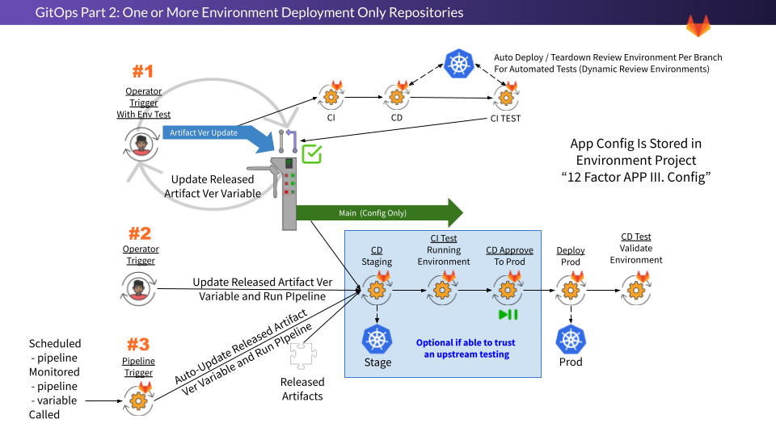

# Lab 4.3: Prepare the Environment Deployment Project

> **Keyboard Time**: 25 mins, **Automation Wait Time**: 5 mins
>
> **Scenarios:** Instructor-Led, Self-Paced



1. Create a GitOps Environment Deployment project from a template.

2. Configure it to monitor the Application Build project for new images.

3. Create a token so that the CI job can write back the constructed manifests back to it’s own project.

4. Do a dry run to see if the manifests update as expected.

   

{}

> You will be using #2 and #3 in labs.

{}

1. While in 'yourpersonalgroup' (created in a prior lab) *Click* **New project** (button) and then *Click* **Import project**
2. On the 'Import project' page, *Click* **Repository by URL**
3. On the next page, for 'Git repository URL' *Paste* **https://gitlab.com/guided-explorations/gl-k8s-agent/gitops/envs/world-greetings-env-1.git**
4. In 'Project name' *Type* **World Greetings Env 1** (likely already be defaulted to this)
5. Near the bottom of the page *Click* **Create project** (button)
6. When the import is complete, you will be placed in the default landing page of the project.

    
For the next steps you will create a Personal Access Token so that the CI job can commit the kubernetes manifests back to its own repository. If you have a GitLab license, a project level ‘Access Token’ is a better way to ensure that the automation credentials do not depend on regular user credentials.
    

1. In the upper right of the page *Click* **[your Avatar icon]** and then *Click* **Edit profile**

2. On the left naviagion, *Click* **Access Tokens**

3. Under ‘Add a personal access token’, for Token name, *Type* **WriteRepository**

4. Under ‘Select scopes’

   1. *Select* **read_repository**
   2. *Select* **write_repository**

5. *Click* **Create personal access token** (button)

    
Notice the same page reloads, but at the top of the screen now has a grey box containing the token information.

**IMPORTANT** - Do not navigate to another page in this browser as this is the only time you can see the token. You will have to create a new token if you leave the page.
    

12. Under ‘Your new personal access token’, to the right of the token value, *Click* **[the Clipboard Icon]**

13. **In a NEW browser tab**, open the project 'yourpersonalgroup/world-greetings-env-1' again (this time we are at the PROJECT level).

14. On the left navigation, *Click* **Settings => CI/CD**

15. To the right of ‘Variables’, *Click* **Expand**

16. *Click* **Add variable**

17. For Key, *Type* **PROJECT_COMMIT_TOKEN**

18. In the Value field *Paste* **[the Clipboard contents]**

19. Under Flags, *Deselect* **Protect variable**

20. Under Flags, *Select* **Mask variable**

21. *Click* **Add variable**

22. To add another variable, *Click* **Add variable**

23. For Key, *Type* **PROJECT_COMMIT_USER**

24. In the Value field *Type* **[your_gitlab_user_name]**

25. Under Flags, *Deselect* **Protect variable**

26. *Click* **Add variable**

    

You should now have two variables in the 'yourpersonalgroup/world-greetings-env-1' project that contains PROJECT_COMMIT_TOKEN and PROJECT_COMMIT_USER.

These permissions are least privilege, in part, because the CI/CD Variables are only published at the project level.
    

27. In the left navigation, *Click* **Repository => Files** 

28. On the upper right of the Project page, *Click* **Web IDE**

29. In a new browser tab, open your ‘yourpersonalgroup/hello-world’ Project. (not the same project you are in now)

30. On the left navigation panel, *Click* **Packages & Registries => Container Registry**

31. Next to the line item ending in “/main”, *Click* **[the Clipboard icon]**

32. In your browser tabs, *Switch* back to the **[tab where you have the Web IDE opened on the World Greetings Env 1 project]**.

33. In the files list, *Click* **.gitlab-ci.yaml**

34. Under ‘variables:’ *Find* **IMAGE_NAME_TO_MONITOR**

35. In the quoted value, *Remove* **everything except ${SERVICE_NAME}/main** 

36. Paste your copied text at the start of the value and ensure it ends in /${SERVICE_NAME}/main

37. *Remove* **hello-world/main** from the pasted string.

    > The result should be something like **IMAGE_NAME_TO_MONITOR: "registry.gitlab.com/guided-explorations/gl-k8s-agent/gitops/apps/${SERVICE_NAME}/main"** but ‘registry.gitlab.com/guided-explorations/gl-k8s-agent/gitops/apps’ will be the registry path to your specific Application Project’s registry.

38. Ensure that the value **SERVICE_NAME: "hello-world"**  matches the actual path name of your Application Project (it should already match if you used the default when importing the Application Project)

39. *Click* **Create commit...**

40. *Select* **Commit to main branch** (change from “Create a new branch”)

41. *Click* **Commit**

42. In the very bottom left, immediately after the text ‘Pipeline’ *Click* **[the pipeline number which is preceeded with a \#]** (Or on the left navigation *Click* **CI/CD => Pipelines** and *Click* **[the status badge]** or [pipeline #] for the latest running pipeline)

43. Expand the Downstream pipeline with the great than arrow (`>`).
    
    The error message: 

    level=fatal msg="authenticating creds for \"registry.gitlab.com\": Requesting bear token: invalid status code from registry 403 (Forbidden)”
    

can be caused by:

- a badly formed value in IMAGE_TO_MONITOR in world-greetings-env-1/.gitlab-ci.yml
- the variables READ_REG_USER and READ_REG_TOKEN
  - being incorrectly named, 
  - at the wrong group level or 
  - having invalid values.


44. **[Automation wait: ~3 min]** Watch the pipeline complete through the ‘staging’ job.

45. The update-staging-manifests job should complete successfully.

46. To get back to the Web IDE, *Click* **[the browser back button]**

47. *Click* **[the browser refresh button]**

48. In the files list on the left *Click* **manifests > hello-world.staging.yaml**

49. *Search* for **- image:**

50. The image reference should be the registry pointer to your Application Project, followed by the latest-prod image version (“1.0.0” if you only built the Application Project twice, maybe higher if you did more builds) 

    > Be sure you refreshed the browser

51. In the files list on the left *Click* **manifests > hello-world.production.yaml**

52. *Search* for **- image:**

53. The image reference should match the old location you copied the Application Project from, followed by a version that most likely is not the same as your staging image.

54. **In a NEW browser tab**, open 'yourpersonalgroup/world-greetings-env-1' again.

    > Shortcut - right click the project heading in the left navigation and *Click* **Open Link in New Tab**) 

55. In the left navigation *Click* **CI/CD => Pipelines**

56. Find the last non-skipped pipeline and *Click* it’s **[Status badge]** or **[Pipeline \#]** to open the pipeline.

57. Expand the Downstream pipeline with the great than arrow (`>`).

58. Next to the update-production-manifests job, *Click* **[the play button]**

59. **[Automation wait: ~1 min]** Wait until the update-production-manifests job has a green check next to it.

60. In the browser tabs, *Switch* back to **[the Web IDE tab]**

62. *Click* **[the browser refresh button]**

62. In the files list on the left *Click* **manifests > hello-world.production.yaml**

63. *Search* for **- image:**

64. The image reference and version tag should match the staging manifest (hello-world.staging.yaml) which should be the latest-prod tagged image in the Hello World Application Build project.



The manifests are not yet monitored by the GitLab Agent, but once they are, the action of updating them in the project is all that is necessary for the GitLab Agent to find them and update the Kubernetes Cluster to match the manifest.




This source project followed several specific principles that makes it this easy to use as a template:

1. Soft codes most of the paths to be self referential to the project path name.
2. When looking in the project container registry for the last image version, it relies on the exact named variables for the authentication token that were setup as part of the Application Build project.
3. It relies on several of the variables that were configured at the classgroup level for the Kubernetes Agent integration.





1. Create a GitOps Environment Deployment project from a template.

2. Configure it to monitor the Application Build project for new images.

3. Create a token so that the CI job can write back the constructed manifests back to it’s own project.

4. Do a dry run to see if the manifests update as expected.

   
