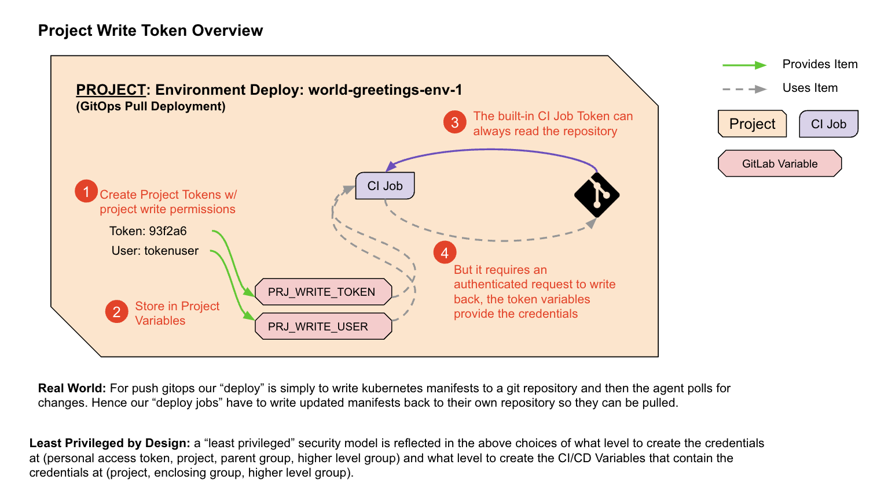

# Lab 4.3: Prepare the Environment Deployment Project

> **Keyboard Time**: 25 mins, **Automation Wait Time**: 5 mins
>
> **Scenarios:** Instructor-Led, Self-Paced



1. A common GitOps convention is to seperate Application Build repositories from Environment Deployment repositories. This lab sets up the Environment Deployment repository to follow this convention.
2. Completely constructed manifests are stored in a repository for easy human reading, visibility and source control managed state. This project creates such manifests under two conditions: 
   1. when the source code of this project is altered, 
   2. when a new version of the Application Build container is detected or specified.





1. Create a GitOps Environment Deployment project from a template.

2. Configure it to monitor the Application Build project for new images.

3. Create a token so that the CI job can write back the constructed manifests back to it’s own project.

4. Do a dry run to see if the manifests update as expected.

   

{}

> You will be using #2 and #3 in labs.

{}

1. While in 'yourpersonalgroup' (created in a prior lab) *Click* **New project** (button) and then *Click* **Import project**
2. On the 'Import project' page, *Click* **Repository by URL**
3. On the next page, for 'Git repository URL' *Paste* **https://gitlab.com/guided-explorations/gl-k8s-agent/gitops/envs/world-greetings-env-1.git**
4. In 'Project name' *Type* **World Greetings Env 1** (likely already be defaulted to this)
5. *Scroll down* to ‘Visibility Level’
6. *Click* **Public**.

    
Projects that are used by the GitLab Agent must be public when the agent registration is done in a project other than the one the deployment happens from and when the image being sourced is not using a stored docker login secret.
     

7. Near the bottom of the page *Click* **Create project** (button)
8. When the import is complete, you will be placed in the default landing page of the project.

   
   For the next steps you will create a Token so that the Environment Deployment project can read the container image of this Application Build project. If you have a paid GitLab license, a group level ‘Access Token’ can give the same access to all container registries in a group heirarchy. This works well if there is high trust between all Application Build and Environment Deployment projects as there are fewer credentials granted at an appropriate level.
   



1. **Instructor-Led Classroom:** Please ask the instructor whether to use **Token Option 1: Using a Project Access Token (Paid Licenses Only Feature)** or **Token Option 2: Using a Personal Access Token (PAT)** 

2. **Self-paced:** Try **Token Option 1: Using a Project Access Token (Paid Licenses Only Feature)** first. If your instance does not have a specific GitLab paid license feature you will be directed to **Token Option 2: Using a Personal Access Token (PAT)**.





**IMPORTANT**: Requires a paid GitLab license, even an ultimate trial will not have the Project Level Access Token Feature. The project menu choice **Settings => Access Tokens** will not exist. You will need to use “Token Option 2” below.

1. While in 'yourpersonalgroup/world-greetings-1' (created in a prior lab), on the left navigation, *Click* **Settings => Access Tokens**

   > This menu option will not exist if you do not have a paid GitLab license.  You will need to use “Token Option 2” below.

2. Under ‘Add a project access token’, for Token name, *Type* **WriteRepository**

3. Under ‘Select a role’, *Select* **Maintainer**

4. Under ‘Select scopes’

   1. *Select* **read_repository** (**DO NOT SELECT** read_registry)
   2. *Select* **write_repository**(**DO NOT SELECT** write_registry)

5. *Click* **Create project access token** (button)


   Notice the same page reloads, but at the top of the screen now has a grey box containing the token information.
   **IMPORTANT** - Do not navigate to another page in this browser as this is the only time you can see the token. You will have to create a new token if you leave the page.


6. Use copy and paste to record the following in a temporary document (do not hand type tokens):
    - PROJECT_COMMIT_TOKEN = **[project access token from UI]**

7. On the left navigation, *Click* **Project Information => Members**

8. In the search prompt *Type* **WriteRepository**

    > The user list should return one entry

9. In the listing, under “WriteRepository”, copy the user name that starts with “project\_” and ends with “\_bot” - do not include the `@` sign.

10. In the previous temporary document, record:

    - PROJECT_COMMIT_USER = **[the user id you just copied]**
    





If you are in a shared classgroup environment (including an asynchonous and long lived ones where other students work at other times than yourself), this PAT will be visible to everyone who has access to classgroup. If you are using a production GitLab user id - this step will give repository read and write access to every repository your user id has access to.



1. In the upper right of the page *Click* **[your Avatar icon]** and then *Click* **Edit profile**

2. On the left naviagion, *Click* **Access Tokens**

3. Under ‘Add a personal access token’, for Token name, *Type* **WriteRepository**

4. Under ‘Select scopes’

   1. *Select* **read_repository**
   2. *Select* **write_repository**

5. *Click* **Create personal access token** (button)


   Notice the same page reloads, but at the top of the screen now has a grey box containing the token information.
   **IMPORTANT** - Do not navigate to another page in this browser as this is the only time you can see the token. You will have to create a new token if you leave the page.


6. Record the following in a temporary document:
    - PROJECT_COMMIT_TOKEN = **[personal access token from UI]**
    - PROJECT_COMMIT_USER = **[your gitlab user id without the ‘@’ and without the path]**



1. **In a NEW browser tab**, open the project 'yourpersonalgroup/world-greetings-env-1' again (this time we are at the PROJECT level).

7. On the left navigation, *Click* **Settings => CI/CD**

8. To the right of ‘Variables’, *Click* **Expand**

9. *Click* **Add variable**

10. For Key, *Copy and Paste* **PROJECT_COMMIT_TOKEN**

11. In the Value field *Copy and Paste* **[the temporary document value for PROJECT_COMMIT_TOKEN]**

12. Under Flags, *Deselect* **Protect variable**

13. Under Flags, *Select* **Mask variable**

14. *Click* **Add variable**

15. To add another variable, *Click* **Add variable**

16. For Key, *Copy and Paste* **PROJECT_COMMIT_USER**

17. In the Value field *Copy and Paste* **[the temporary document value for PROJECT_COMMIT_USER]**

18. Under Flags, *Deselect* **Protect variable**

19. *Click* **Add variable**


Among the existing variables in the 'yourpersonalgroup/world-greetings-env-1' project, you should have the two new variables PROJECT_COMMIT_TOKEN and PROJECT_COMMIT_USER.

These permissions are least privilege, in part, because the CI/CD Variables are only published at the project level.


27. In a new browser tab, open your ‘yourpersonalgroup/hello-world’ Project. (**IMPORTANT: not the same project you are in now**)

28. On the left navigation panel, *Click* **Packages & Registries => Container Registry**

29. Next to the line item ending in “/main”, *Click* **[the Clipboard icon]**

30. **IMPORTANT:** Switch back to ‘yourpersonalgroup/world-greetings-env-1’ Project

31. In the left navigation, *Click* **Repository => Files** 

32. On the upper right of the Project page, *Click* **Web IDE**

33. In the files list, *Click* **.gitlab-ci.yml**

34. Under ‘variables:’ *Find* **IMAGE_NAME_TO_MONITOR**

35. In the quoted value, *Remove* **the existing value** 

36. Paste your copied image path

    > The result should be something like **IMAGE_NAME_TO_MONITOR: "registry.gitlab.com/somegroups/classgroup/yourpersonalgroup/hello-world/main"**

37. *Click* **Create commit...**

38. *Select* **Commit to main branch** (change from “Create a new branch”)

39. *Click* **Commit**


The pipeline id link may take up to 30 seconds to appear as the CI job has to kick off before it displays.


40. In the very bottom left, immediately after the text ‘Pipeline’ *Click* **[the pipeline number which is preceeded with a \#]** (Or on the left navigation *Click* **CI/CD => Pipelines** and *Click* **[the status badge]** or [pipeline #] for the latest running pipeline)

41. Expand the Downstream pipeline with the great than arrow (`>`).
    
    

Possible error messages (not an exhaustive list): 

    level=fatal msg="authenticating creds for \"registry.gitlab.com\": Requesting bear token: invalid status code from registry 403 (Forbidden)”
    .
    
    level=fatal msg="error logging into \"registry.gitlab.com\": invalid username/password"

can be caused by:

- a badly formed value in IMAGE_TO_MONITOR in world-greetings-env-1/.gitlab-ci.yml
- the variables READ_REG_USER and READ_REG_TOKEN
  - being incorrectly named, 
  - at the wrong group level or 
  - having invalid values or accidental swapping of the values (e.g. User Id in READ_REG_TOKEN)
  - READ_REG_USER starting with `@` (this should be left off)
  - having incorrect permissions in the token (should be “read_registry”, not “read_repository”)

    The error message: 

    remote: GitLab: You are not allowed to push code to protected branches on this project.
    ! [remote rejected] main -> main (pre-receive hook declined)

    error: failed to push some refs to <project path>

can be caused by:

- You did not select ‘Maintainer’ for the token role when setting up the repository write token above.



42. **[Automation wait: ~3 min]** Watch the pipeline complete through the ‘update-staging-manifests’ job.

43. The update-staging-manifests job should complete successfully.

46. To get back to the Web IDE, *Click* **[the browser back button]**

47. *Click* **[the browser refresh button]**

48. In the files list on the left *Click* **manifests > hello-world.staging.yaml**

49. *Search* for **- image:**

50. The image reference should be the registry pointer to your Application Project, followed by the latest-prod image version (“1.0.0” if you only built the Application Project twice, maybe higher if you did more builds) 

    > Be sure you refreshed the browser


In the next steps you will observe that the production manifest has not change yet because you have not approved the deployment to production yet.


51. In the files list on the left *Click* **manifests > hello-world.production.yaml**

52. *Search* for **- image:**

53. The image version tag does not match staging. (If all labs were done as described it should say `registry.gitlab.com/_replace-with-hello-world-service-container-registry-path_:5.5.5`)

54. **In a NEW browser tab**, open 'yourpersonalgroup/world-greetings-env-1' again.

    > Shortcut - right click the project heading in the left navigation and *Click* **Open Link in New Tab**) 

55. In the left navigation *Click* **CI/CD => Pipelines**

56. Find the last non-skipped pipeline and *Click* it’s **[Status badge]** or **[Pipeline \#]** to open the pipeline.

57. Expand the Downstream pipeline with the great than arrow (`>`).

    > NOTE: Depending on your screen width, you may need to use the horizontal scroll bar under the pipeline to find the update-production-manifests job.

58. Next to the update-production-manifests job, *Click* **[the play button]**

59. **[Automation wait: ~1 min]** Wait until the update-production-manifests job has a green check next to it.

60. In the browser tabs, *Switch* back to **[the Web IDE tab]**

61. *Click* **[the browser refresh button]**

62. In the files list on the left *Click* **manifests > hello-world.production.yaml**

63. *Search* for **- image:**

64. The image reference and version tag should match the staging manifest (hello-world.staging.yaml) which should be the latest-prod tagged image in the Hello World Application Build project.



The manifests are not yet monitored by the GitLab Agent, but once they are, the action of updating them in the project is all that is necessary for the GitLab Agent to find them and update the Kubernetes Cluster to match the manifest.




This source project followed several specific principles that makes it this easy to use as a template:

1. Soft codes most of the paths to be self referential to the project path name.
2. When looking in the project container registry for the last image version, it relies on the exact named variables for the authentication token that were setup as part of the Application Build project.
3. It relies on several of the variables that were configured at the classgroup level for the Kubernetes Agent integration.





1. Create a GitOps Environment Deployment project from a template.

2. Configure it to monitor the Application Build project for new images.

3. Create a token so that the CI job can write back the constructed manifests back to it’s own project.

4. Do a dry run to see if the manifests update as expected.

   
