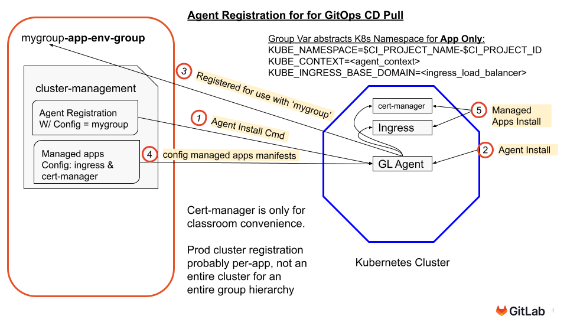
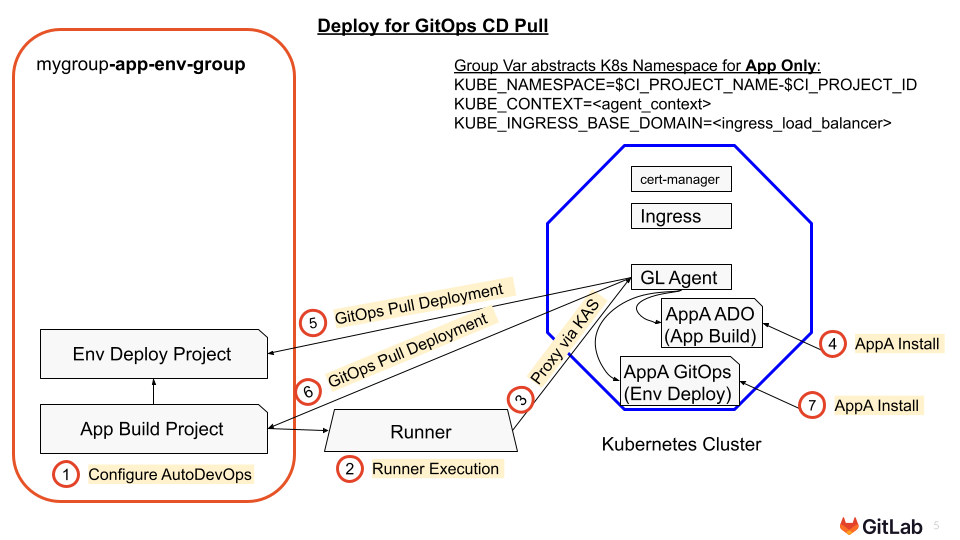

### Overview of The Need for Multiple Environment Deployment Projects Per Application Build Project That Results in Separated Projects

{}

While this model shows one service from one Application Project being deployed by one Environment Deployment Project - it can also be a great starting point for modelling a multi-service application that consumes multiple Application Project outputs which may have multiple Environment Deployment Projects for various purposes.

Some of these models will have a high number of “listening” Environment Deployment repositories for each artifact producing repository:

- **Dedicated Tenancy** - one production per customer - sometimes with their own staging environment and sometimes with customer control over new version deployment.
- **Geographical Tenancy for Data Sovereignty** - Data must reside in a specific country.
- **Multi-GEO Tenancy for Performance** - global performance.
- **Multi-Cloud Tenancy** - Avoid lock in, meet customer requirements.
- **Seperation of Ops Governance** - Strong separation of security, Ops duties and/or release cycles between Dev and Ops and/or between multiple Ops teams. For example Gov and Commercial deployments of the same software.
- **Customer Extensible Software** - some has customer extensions that have to be tested in a customer’s staging environment
- **Customer Owned Deployment Environments** - the customer owns and hosts the deployment environment while consuming container artifacts from a different company who makes the software

{}

### Visual Overview of Agent Registration for GitOps CD Pull

{}

{}

### Visual Overview of Deploy for GitOps CD Pull

{}

{}

### Visual Overview of GitLab Application Build Project Pipeline

{}**Key Concepts:**

1. This pattern has developed as an industry defacto pattern for GitOps (It is not a GitLab specific construction)
2. The final result of this type of project is to publish a new release artifact for consumption - delivery / deployment is then done by the Environment Deployment projects monitoring it.

{}

### Visual Overview of GitOps Application Building Project

{}

**Key Concepts:**

1. The looser these projects are “coupled” (fewest dependencies) the more flexible they are for multiple environment targets and how those environments wish to consume updates to the application containers.

   **Loose Coupling** means that there are the fewest dependencies in terms of shared security, shared configuration and shared pipeline execution between the project building the application (aka Application Project) and the project(s) consuming the build artifacts (aka Environment Deployment Project(s)). It facilitates high scale of Environment Deployment projects against a given Application Project. It also facilitates seperation of duties between Dev and Ops and/or multiple Ops teams. A Loose Coupling approach is supported by the following 12 Factor App principles: "[I. Codebase](https://12factor.net/codebase)", "[III. Config](https://12factor.net/config)" and "[X. Dev/prod party](https://12factor.net/dev-prod-parity)”

2. The multiple consumption models listed here are enabled by the working example projects in this workshop - not all options are done as exercises.

3. Whether the Environment Deployment project does Continuous Delivery to Staging or Continuous Deployment to Production is configurable and would depend on:

   1. How much trust can be placed in the Application Build Project for “production like testing”.
   2. Whether the deployment environment has aspects that cannot be tested in the Application Build Project and so need to be tested here.

{}

### Visual Overview of Leveraging Least Config For Group Level Kubernetes Integration & Least Privilege for GitOps Pull Deployment

{}

**Key Concepts:**

1. The looser these projects are “coupled” (fewest dependencies) the more flexible they are for multiple environment targets and how those environments wish to consume updates to the application containers.

   **Loose Coupling** means that there are the fewest dependencies in terms of shared security, shared configuration and shared pipeline execution between the project building the application (aka Application Project) and the project(s) consuming the build artifacts (aka Environment Deployment Project(s)). It facilitates high scale of Environment Deployment projects against a given Application Project. It also facilitates seperation of duties between Dev and Ops and/or multiple Ops teams. A Loose Coupling approach is supported by the following 12 Factor App principles: "[I. Codebase](https://12factor.net/codebase)", "[III. Config](https://12factor.net/config)" and "[X. Dev/prod party](https://12factor.net/dev-prod-parity)”

2. The multiple consumption models listed here are enabled by the working example projects in this workshop - not all options are done as exercises.

{}

### Visual Overview of Leveraging Existing Metadata for Version Comparison

{}

**Key Concepts:**

1. Encoding the version as both a container tag and a container label allows retrieval of the latest version without enumerating and sorting all tags to select the latest.
2. This method is used by the Application Build project to self-increment the version number and by the Environment Deployment Project to detect a new version.
3. Notice that ‘latest-prod’ tagging is used so as to not conflict with other uses of the plain ‘latest’ tag - but still allow complete control over exactly when and by what criteria a GitOps image is deemed “production ready” by the Application Build Project.

{}